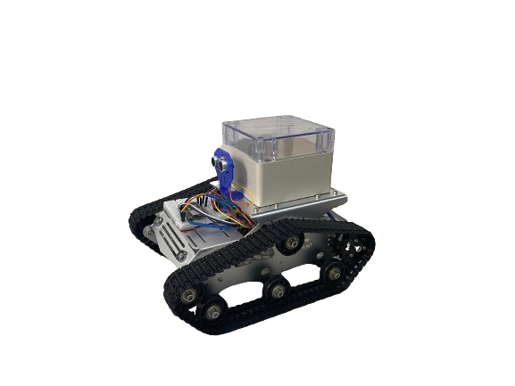

# MACROBOT

## Intro
`what does the term "macrobot" even mean?` 
`macro` in this context refers to a computer macro which is a series of commands and actions that can be stored and run whenever you need to perform a computer task. Whereas `bot` is a term widely used as a synonym to `robot`. Together we get the term `macrobot`.

## Hardware

<ul>
  <li><b>ESP32 Devboard</b> the microcontroller in charge of controlling everything related to the robot and applying software inputs to the hardware.</li>
  <li><b>L298N dual motor driver</b> communicates with the microcontroller to move the motors.</li>
  <li><b>2x 9V motors</b> powerful-enough motors that allow the movement of the robot with exceptional load.</li>
  <li><b>2x motor encoders</b> provides sensory data from the motor that allow us to program the robot to move in perfect straight lines.</li>
  <li><b>HC-SR04 sensor</b> provides the distance of possibly blocking objects that might be infront of the robot (initial version didn't have a rear sensor but that could be easily added).</li>
  <li><b>Aluminium tank-like chassis</b> A heavyduty robust tank-like chassis that could withstand high weight loads with a geared moving mechanism</li>
</ul>

## Software

the ESP32 starts an access point that can easily be connected to through Wi-Fi. After that it hosts a local webpage that can be accessed through any web browser on any device. The webpage then communicates with the microcontroller through websocket events and http requests. Above all that is a user-friendly interface with an amazing user experience.

